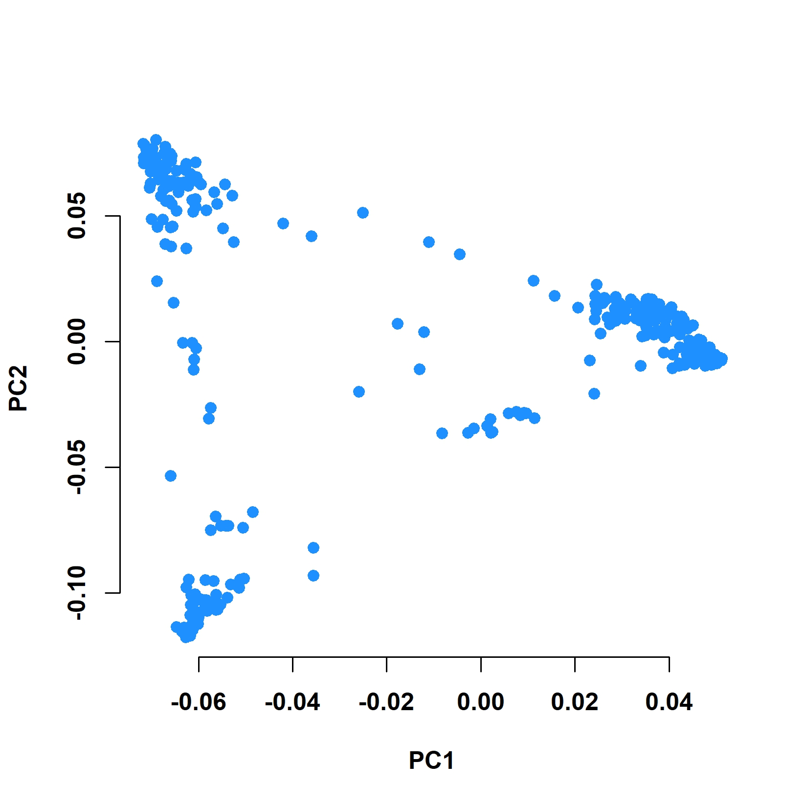
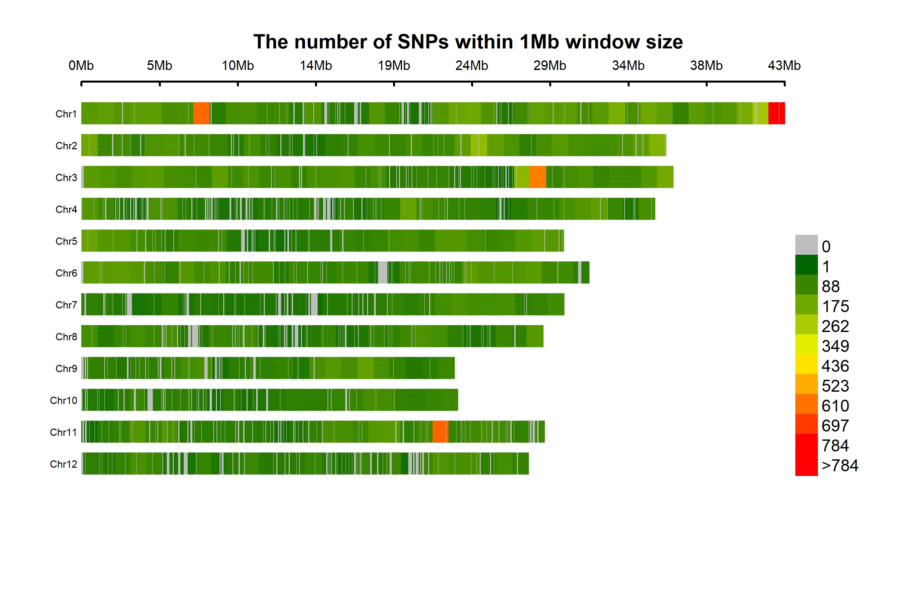
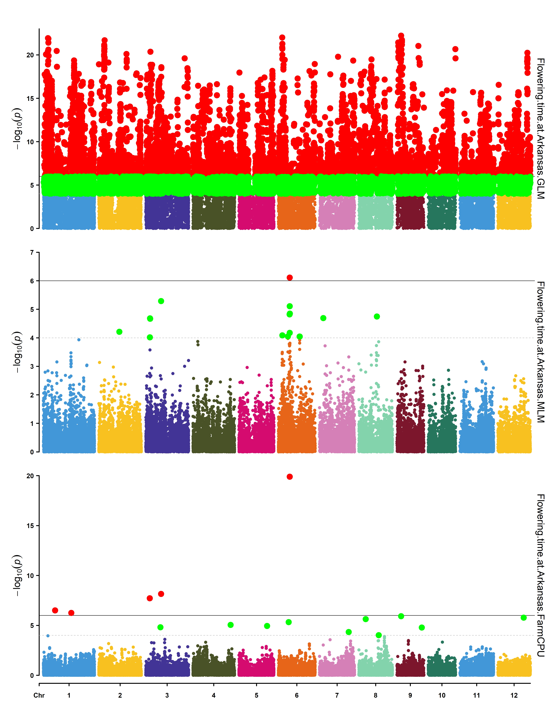
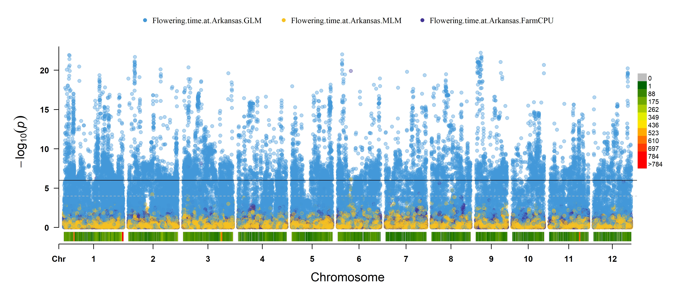
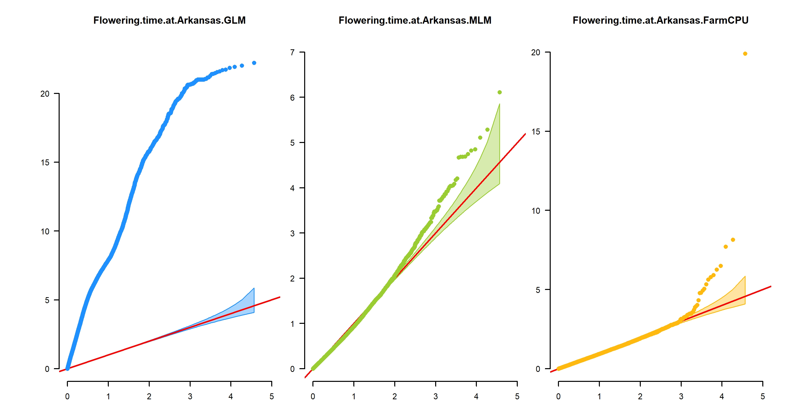
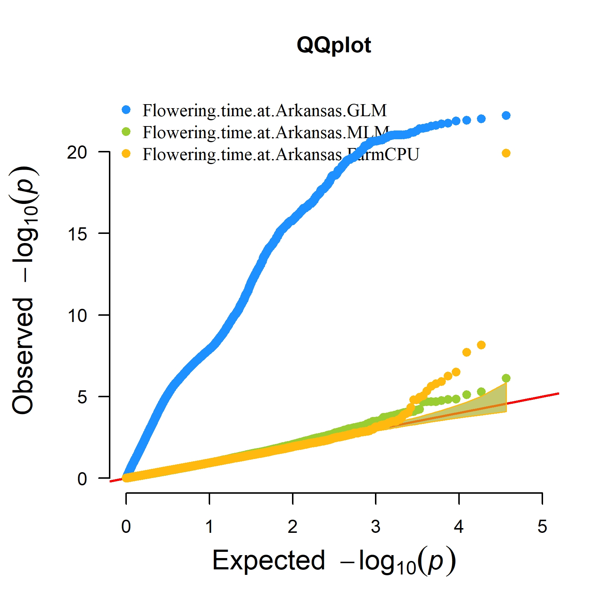

# Project Setup

```{r}
#| label:  setup

source("https://inkaverse.com/docs.r")

cran <- c("devtools", "tidyverse", "openxlsx", "rMVP", "CMplot")
git <- c("hemstrow/snpR") 

suppressPackageStartupMessages({
  for (pkg in cran) { 
    if( !require(pkg, character.only = TRUE) ) {
      install.packages(pkg)
      library(pkg, character.only = TRUE)
    } 
  }
  
  for (pkg in git) {
    if( !require(sub(".*/", "", pkg), character.only = TRUE) ) {
      devtools::install_github(pkg, upgrade = TRUE)
      library(sub(".*/", "", pkg), character.only = TRUE)
    }
  }
}); remove(cran, git, pkg)

cat("Project: ", getwd(), "\n")
session_info()
```

# Reference

-   (article) https://www.nature.com/articles/ncomms1467
-   (44K SNP set) http://www.ricediversity.org/data/
-   (data) http://ricediversity.org/data/sets/44kgwas/
-   https://github.com/hemstrow/snpR/blob/master/vignettes/snpR_introduction.Rmd
-   https://doi.org/10.32614/CRAN.package.rMVP
-   https://www.cog-genomics.org/plink/2.0/

# Tranformar datos

#### *Importante, antes de correr el chunk "bash" asegurarse a haber descargado y configurado el programa PLINK*

```{bash}
#| eval: false

plink2 --ped sativas413.ped \
       --map sativas413.map \
       --export vcf \
       --out sativas413
```

# Import data

```{r}
#Creamos una caprte para guardar los archivos


#Leemos los archivos con la data fenotipica, información y genotipica (VCF)
pheno <- read.xlsx("sativas413.xlsx")
geno <- snpR::read_vcf("sativas413.vcf")
info <- read.xlsx("sativas413info.xlsx") %>% 
  select(id = "GSOR.ID", spop = "Sub-population") %>% 
  tibble()

sample_meta <- geno %>% 
  names() %>% 
  gsub("_.*", "", .) %>% 
  enframe(value = "pop") %>% 
  bind_cols(., info)

sample.meta(geno)$spop <- sample_meta$spop

sample.meta(geno)
snp.meta(geno)
```

# PCA raw-data

```{r}
pca <- plot_clusters(geno
                     , facets = "spop"
                     , check_duplicates = T
                     , plot_type = "pca"
                     )

pca$plots$pca
```

**Interpretación:** *El componente 1 explica el 38.85% de la variación genética total, mientras que el componente explica el 9.2%, explicando casi el 48% de la variación, se aprecia la formación de tres grupos genéticos, las poblaciones que están separadas a lo largo de un eje, implica que difieren en los alelos de los SNPs que más contribuyen a ese componente. La separación clara es de AUS y TEJ sugiere que son genéticamente distintos del resto. Posiblemente se trata de subespecies o linajes ancestrales bien definidos.*

# rMVP: Memory-efficient, Visualization-enhanced, and Parallel-accelerated Genome-Wide Association Study

## Import data

```{r}
#Preparamos los individuos de la data "sample_meta"
sample_meta <- geno %>% 
  names() %>% 
  enframe(value = "Taxa") %>% 
  mutate(HybID = gsub("_.*", "", Taxa)) %>% 
  select(!name)
dir.create("mvp") #Usar esta linea cuando no se tenga la carpeta
dir.create("mvp/gwas") ##Usar esta linea cuando no se tenga la carpeta (En esta carpera se colocaran los resultados)
pheno <- read.xlsx("sativas413.xlsx") %>% 
  base::merge(., sample_meta) %>% 
  select(Taxa, everything()) %>% 
  select(!HybID) %>% 
  write_csv("mvp/sativas413.csv")

MVP.Data(fileVCF = "sativas413.vcf"
         , filePhe = "mvp/sativas413.csv"
         , sep.phe = ","
         , priority = "speed"
         , fileKin = FALSE
         , filePC = FALSE
         , out = "mvp/gwas"
         )
```

## Kinship

```{r}
MVP.Data.Kin(fileKin = TRUE
             , mvp_prefix = 'mvp/gwas'
             , out = 'mvp/gwas')
```

## Data input

```{r}
genotype <- attach.big.matrix("mvp/gwas.geno.desc")
phenotype <- read.table("mvp/gwas.phe", head = TRUE)
mapping <- read.table("mvp/gwas.geno.map", head = TRUE)
kinship <- attach.big.matrix("mvp/gwas.kin.desc")
```

## GWAS

Nota: Para este analsis se uso la variable "Flowering.time.at.Arkansas"

```{r}
phenotype %>% names()

trait <- phenotype %>% 
  select(1, "Flowering.time.at.Arkansas")

imMVP <- MVP(
  phe = trait
  , geno = genotype
  , map = mapping
  , K = kinship
  , method = c("GLM", "MLM", "FarmCPU")
  , outpath = "mvp/gwas"
  , file.output = TRUE
  , file.type = "csv"
  , ncpus = 4
  )

gc()

```

## PCA

```{r}
genoPath <- "mvp/gwas.geno.desc"
genopca <- attach.big.matrix(genoPath)
pca <- MVP.PCA(M = genopca, cpu = 1)

MVP.PCAplot(PCA = pca
            , pch = 19
            , outpath = "mvp/gwas"
            , file.output = T
            , file.type = "jpg"
            )
```



## SNP density-plot

```{r}
MVP.Report(MVP = imMVP
           , plot.type="d"
           , col=c("darkgreen", "yellow", "red")
           , file.type="jpg", dpi=300
           , outpath = "mvp/gwas"
           )
```



## Phenotype distribution

```{r}
MVP.Hist(phe = trait
         , outpath = "mvp/gwas"
         , file.type="jpg", breakNum=18, dpi=300)
```


## Manhatan

```{r}
MVP.Report(imMVP
           , plot.type = "m"
           , multracks = TRUE
           , threshold = c(1e-6, 1e-4)
           , threshold.lty=c(1,2)
           , threshold.lwd=c(1,1)
           , threshold.col=c("black","grey")
           , amplify = TRUE
           , bin.size = 1e6
           , chr.den.col = c("darkgreen", "yellow", "red")
           , signal.col = c("red","green")
           , signal.cex = c(1,1)
           , file.type = "jpg", memo = "", dpi = 300
           , outpath = "mvp/gwas"
        )
```



-   **Interpretacion con el modelo GLM:** *Se identificaron 9202 SNPs en todo el genoma que pueden tener asoscion con el tiempo de floración (Ver el resultado: Flowering.time.at.Arkansas.GLM_signals.csv).*

-   **Interpretacion con el modelo MLM**: *El SNP id6006118, ubicado en el cromosoma 6 en la posición 9,651,785, muestra una asociación estadísticamente significativa con el tiempo de floración en Arkansas (p = 7.77×10⁻⁷), según un modelo MLM. El alelo alternativo T, con una frecuencia menor (MAF) de 12.7%, está asociado con un aumento de 5.74 unidades en el tiempo de floración. Este resultado sugiere que este SNP podría estar vinculado a una región genómica que influye significativamente en este rasgo fenotípico (Ver el resultado: Flowering.time.at.Arkansas.MLM_signals.csv).*

-   **Interpretacion con el modelo FarmCPU:** *Identificó varios SNPs significativamente asociados con el tiempo de floración en Arkansas. Destaca el **SNP id6006118** en el **cromosoma 6**, con un **efecto positivo de 8.59** días y un p-valor altamente significativo (**1.27×10⁻²⁰**), lo que sugiere una fuerte influencia sobre el rasgo. También se identificó el **SNP id3006754** en el **cromosoma 3** con un gran efecto positivo (**12.85**) y una baja frecuencia alélica (MAF = 0.008), indicando un posible alelo raro de gran impacto. Otros SNPs relevantes incluyen **id3001824**, **id1013613**, **id1007272** y **id9000871**, con efectos tanto positivos como negativos, y p-valores entre **10⁻⁶ y 10⁻⁸**, lo que refuerza su potencial implicación en la regulación del tiempo de floración. Estos hallazgos ofrecen candidatos prometedores para estudios funcionales y selección genómica en programas de mejoramiento(Ver el resultado: Flowering.time.at.Arkansas.FarmCPU_signals.csv).*



## Q-Q plot

```{r}
MVP.Report(imMVP
           , plot.type = "q"
           , col = c("dodgerblue1", "olivedrab3", "darkgoldenrod1")
           , threshold = 1e6
           , signal.pch = 19
           , signal.cex = 1.5
           , signal.col = "red"
           , box = FALSE 
           , multracks = TRUE
           , file.type="jpg",memo="",dpi=300
           , outpath = "mvp/gwas"
           )
```




